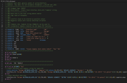
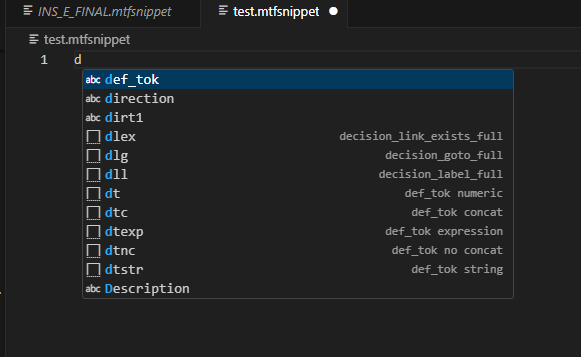

# 12d MTF Snippet Support

VS Code language support for **12d Model** `*.mtfsnippet` files, providing syntax highlighting and high-value authoring snippets.

This is a **pure language extension** — no runtime code, no execution, no validation.

---

## Quick start

1. Install the extension **12d MTF Snippet Support**
2. Open any file with the `.mtfsnippet` extension
3. Start typing a snippet prefix and press `Tab`, or use `Ctrl+Space` to trigger IntelliSense

---

## Features

- Syntax highlighting for `*.mtfsnippet`
- Line comments:
  - `//` normal comments
  - Directive-style comments such as `// PARAMETER`, `// DISPLAY`, `// INFO`
- Block comments:
  - `/* ... */`
- Highlighting for control-flow directives:
  - `@ if`, `@ else`, `@ end_if`, `@ repeat`, `@ end_repeat`
- Logical operators: `&&`, `||`
- Arithmetic operators: `+ - * /`
- Token highlighting:
  - `$()` variables
  - `$(_XXXX)` macro aliases
- Token awareness inside strings when wrapped in `$()`
- Authoring snippets via IntelliSense

---

## Included snippets

### Control flow

| Prefix | Description |
|------|-------------|
| `ifb` | Basic `@ if` / `@ end_if` block |
| `ifeqi` | `@ if_val_eq_int` block |
| `ifnei` | `@ if_val_ne_int` block |
| `elseb` | `@ else` block |
| `rep` | `@ repeat` / `@ end_repeat` block |

---

### `@ def_tok`

| Prefix | Description |
|------|-------------|
| `dt` | Numeric token |
| `dtexp` | Expression token |
| `dtstr` | String token |
| `dtc` | Concatenation token |
| `dtnc` | `@ def_tok_no_concat` |

---

### Insert & fixed patterns

| Prefix | Description |
|------|-------------|
| `ins` | Basic insert |
| `insb` | Insert before link |
| `insa` | Insert after link |
| `insi` | Insert with interval override |
| `lfx` | Single-dimension fixed modifier |
| `lfxall` | `mod_all` fixed modifier |

All snippets are **generic** and make no domain assumptions.

---

## Examples

### Control flow

@ if ${condition}
  // statements
@ end_if

### Token definition
@ def_tok "${NAME}" "${VALUE}"

### Insert / fixed pattern
insert "Design=>$(LN)" "red" ${width} ${height} ${xfall} $(_SCH) 0 $(_ECH) 0 $(_ASE) // comment

## Screenshots

### Syntax highlighting

### Snippet IntelliSense

### File association
This extension activates on:
*.mtfsnippet

### Scope and limitations
This extension does not provide:
- Validation or linting
- Formatting
- Semantic analysis
- Execution or runtime features
- Language Server Protocol (LSP)

It is intentionally limited to syntax awareness and authoring assistance.
