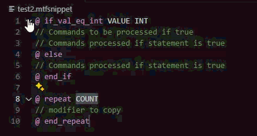

# 12d MTF Snippet Support

VS Code language support for **12d Model** `*.mtfsnippet` files, providing syntax highlighting and a **comprehensive set of authoring snippets derived from the 12d Model Manual (Section 19.7)**.

This is a **pure language extension** — no runtime code, no execution, no validation.

**Control-flow folding for MTF directives (`@ if*`, `@ repeat`) using VS Code folding markers (no runtime code).**

---

## Quick start

1. Install **12d MTF Snippet Support**
2. Open any file with the `.mtfsnippet` extension
3. Start typing a snippet prefix and press `Tab`, or use `Ctrl+Space` to trigger IntelliSense

---

## Features

* Syntax highlighting for `*.mtfsnippet`
* Line comments:

  * `//` normal comments
  * Directive-style comments: `// PARAMETER`, `// DISPLAY`, `// INFO`
* Block comments:

  * `/* ... */`
* Control-flow directives:

  * `@ if`, `@ else`, `@ end_if`, `@ repeat`, `@ end_repeat`
* Logical operators: `&&`, `||`
* Arithmetic operators: `+ - * /`
* Token highlighting:

  * `$()` variables
  * `$(_XXXX)` macro aliases
* Token awareness inside strings when wrapped in `$()`
* Authoring snippets via IntelliSense

---

## Included snippets

### Control flow

| Prefix        | Description                               |
| ------------- | ----------------------------------------- |
| `ifb`         | Basic `@ if` / `@ end_if` block           |
| `ifelse`      | Full `@ if` / `@ else` / `@ end_if` block |
| `ifvaleqint`  | `@ if_val_eq_int` / `@ end_if` block      |
| `ifvalneqint` | `@ if_val_neq_int` / `@ end_if` block     |
| `elseb`       | `@ else` block                            |
| `rep`         | `@ repeat` / `@ end_repeat` block         |

---

### Common structural / helper blocks

| Prefix   | Description                                  |
| -------- | -------------------------------------------- |
| `hdr`    | Standard snippet header block                |
| `abb`    | Abbreviation block                           |
| `alr`    | Automatic left/right handling block          |
| `stdchs` | `$(_STD_CHS)` standard chainage macro block  |
| `absee`  | Absolute extra start / extra end macro block |

---

### @ def_tok

| Prefix  | Description                                                  |
| ------- | ------------------------------------------------------------ |
| `dt`    | Define numeric token (`@ def_tok`)                           |
| `dtval` | Define value-based token (`@ def_tok` with value expression) |
| `dtc`   | Define concatenated token                                    |

---

### Insert & fixed patterns

| Prefix   | Description                     |
| -------- | ------------------------------- |
| `ins`    | Basic insert                    |
| `insb`   | Insert before link              |
| `insa`   | Insert after link               |
| `insi`   | Insert with interval override   |
| `lfx`    | Single-dimension fixed modifier |
| `lfxall` | `mod_all` fixed modifier        |

All snippets are **generic** and make no domain assumptions.

---

## Snippet coverage and source

Snippets in this extension are derived from:

* **12d Model Manual – Section 19.7 (MTF syntax and commands)**

The goal is **authoring assistance**, not abstraction or simplification.
Snippets closely mirror documented 12d syntax, using placeholders only where user input is required.

---

## Recommended workflow (best practice)

The recommended way to create `.mtfsnippet` files is:

1. Build and validate all required modifiers inside the **12d Model MTF editor**
2. Ensure modifiers behave exactly as intended
3. Use **Copy (paste snippet)** in 12d Model to generate a base `.mtfsnippet`
4. Finalize the file in VS Code using this extension:

   * Add parameters, comments, and `INFO` blocks
   * Define tokens (`@ def_tok`)
   * Apply control flow (`@ if`, `@ repeat`)
   * Refine inserts and fixed modifiers using snippets

Starting `.mtfsnippet` files from scratch is **not recommended**.

---

## Examples

### Control flow

@ if ${condition}
  // statements
@ end_if

### Token definition

@ def_tok "${NAME}" "${VALUE}"

### Insert / fixed pattern

insert "Design=>$(LN)" "red" ${width} ${height} ${xfall} $(_SCH) 0 $(_ECH) 0 $(_ASE) // comment

---

## File association

This extension activates on:

* `*.mtfsnippet`

---

## Screenshots

### Syntax highlighting

### Snippet IntelliSense

---

## Scope and limitations

This extension does **not** provide:

* Validation or linting
* Formatting
* Semantic analysis
* Execution or runtime features
* Language Server Protocol (LSP)

It does **not** attempt to reinterpret or redesign MTF syntax defined by 12d Model.
It is intentionally limited to syntax awareness and authoring assistance.